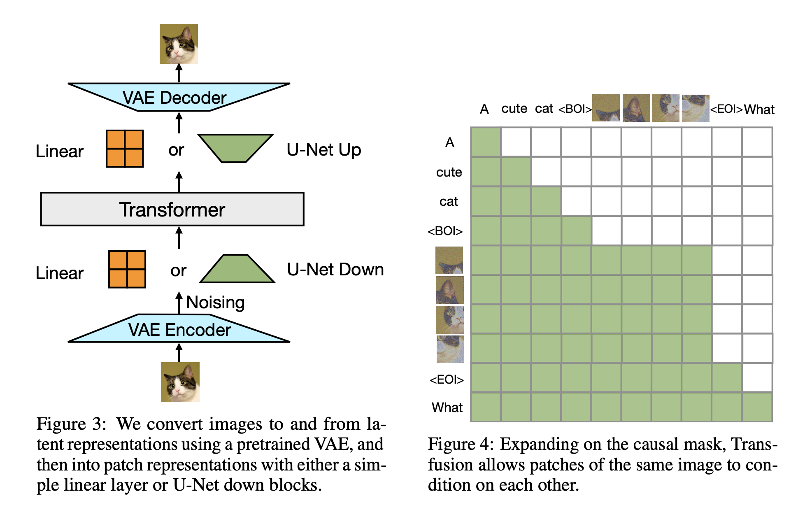

</img>

## Transfusion - Pytorch

Pytorch implementation of [Transfusion](https://www.arxiv.org/abs/2408.11039), "Predict the Next Token and Diffuse Images with One Multi-Modal Model", from MetaAI.

In this repo, we will substitute diffusion with flow matching given the success of Flux from Black Forest Labs (but will keep the original paper title given Transflow does not have the same ring). This repository will also attempt to extend to any number of modalities.

## Install

```bash
$ pip install transfusion-pytorch
```

## Usage

One modality, say images

```python
from torch import randint, randn
from transfusion_pytorch import Transfusion

model = Transfusion(
    num_text_tokens = 256,
    dim_latent = 384,
    modality_default_shape = (4,),  # fallback, in the case the language model did not produce a valid modality shape
    transformer = dict(
        dim = 512,
        depth = 8
    )
)

# any torch.long is text, torch.float is modalities

text_and_images = [
    [randint(0, 256, (16,)), randn(4, 384), randint(0, 256, (8,)), randn(6, 384)],
    [randint(0, 256, (16,)), randn(7, 384), randint(0, 256, (5,)), randn(2, 384), randint(0, 256, (9,))]
]

loss = model(text_and_images)

loss.backward()

# after much training

one_multimodal_sample = model.sample()
```

Multiple different modalities

```python
from torch import randint, randn
from transfusion_pytorch import Transfusion

model = Transfusion(
    num_text_tokens = 256,
    dim_latent = (384, 192),                 # specify multiple latent dimensions
    modality_default_shape = ((4,), (2,)),   # default shapes for first and second modality
    transformer = dict(
        dim = 512,
        depth = 8
    )
)

# then for the Tensors of type float, you can pass a tuple[int, Tensor] and specify the modality index in the first position

# any torch.long is text, torch.float is modalities

text_images_and_audio = [
    [randint(0, 256, (16,)), (0, randn(4, 384)), randint(0, 256, (8,)), (1, randn(6, 192))],
    [randint(0, 256, (16,)), randn(7, 384), randint(0, 256, (5,)), (1, randn(2, 192)), randint(0, 256, (9,))]
]

loss = model(text_images_and_audio)

loss.backward()

# after much training

one_multimodal_sample = model.sample()
```

Automatically taking care of encoding and decoding of images

```python
import torch
from torch import nn, randint, randn
from transfusion_pytorch import Transfusion, print_modality_sample

mock_encoder = nn.Conv2d(3, 384, 3, padding = 1)
mock_decoder = nn.Conv2d(384, 3, 3, padding = 1)

model = Transfusion(
    num_text_tokens = 12,
    dim_latent = 384,
    channel_first_latent = True,
    modality_default_shape = (4, 4),
    modality_encoder = mock_encoder,
    modality_decoder = mock_decoder,
    transformer = dict(
        dim = 512,
        depth = 8
    )
)

text_and_images = [
    [
        randint(0, 12, (16,)),  # 16 text tokens
        randn(3, 8, 8),         # (8 x 8) 3 channeled image
        randint(0, 12, (8,)),   # 8 text tokens
        randn(3, 7, 7)          # (7 x 7) 3 channeled image
    ],
    [
        randint(0, 12, (16,)),  # 16 text tokens
        randn(3, 8, 5),         # (8 x 5) 3 channeled image
        randint(0, 12, (5,)),   # 5 text tokens
        randn(3, 2, 16),        # (2 x 16) 3 channeled image
        randint(0, 12, (9,))    # 9 text tokens
    ]
]

loss = model(text_and_images)

loss.backward()

# after much training

one_multimodal_sample = model.sample()

print_modality_sample(one_multimodal_sample)
```

To pretrain on language first, just pass in your text as type `Int['batch seq']`

```python
import torch
from transfusion_pytorch import Transfusion

model = Transfusion(
    num_text_tokens = 256,
    dim_latent = 384,
    transformer = dict(
        dim = 512,
        depth = 8,
    )
).cuda()

text = torch.randint(0, 256, (2, 1024)).cuda()

loss = model(text)
loss.backward()

# after much training

sampled = model.generate_text_only(text[:, :1], 1024)
```

## Citations

```bibtex
@inproceedings{Zhou2024TransfusionPT,
    title  = {Transfusion: Predict the Next Token and Diffuse Images with One Multi-Modal Model},
    author = {Chunting Zhou and Lili Yu and Arun Babu and Kushal Tirumala and Michihiro Yasunaga and Leonid Shamis and Jacob Kahn and Xuezhe Ma and Luke Zettlemoyer and Omer Levy},
    year   = {2024},
    url    = {https://api.semanticscholar.org/CorpusID:271909855}
}
```

```bibtex
@misc{Rubin2024,
    author  = {Ohad Rubin},
    url     = {https://medium.com/@ohadrubin/exploring-weight-decay-in-layer-normalization-challenges-and-a-reparameterization-solution-ad4d12c24950}
}
```

```bibtex
@article{Nguyen2024MinPS,
    title   = {Min P Sampling: Balancing Creativity and Coherence at High Temperature},
    author  = {Minh Nguyen and Andrew Baker and Andreas Kirsch and Clement Neo},
    journal = {ArXiv},
    year    = {2024},
    volume  = {abs/2407.01082},
    url     = {https://api.semanticscholar.org/CorpusID:270870613}
}
```

```bibtex
@article{Bao2022AllAW,
    title   = {All are Worth Words: A ViT Backbone for Diffusion Models},
    author  = {Fan Bao and Shen Nie and Kaiwen Xue and Yue Cao and Chongxuan Li and Hang Su and Jun Zhu},
    journal = {2023 IEEE/CVF Conference on Computer Vision and Pattern Recognition (CVPR)},
    year    = {2022},
    pages   = {22669-22679},
    url     = {https://api.semanticscholar.org/CorpusID:253581703}
}
```

```bibtex
@inproceedings{Zhao2024MonoFormerOT,
    title     = {MonoFormer: One Transformer for Both Diffusion and Autoregression},
    author    = {Chuyang Zhao and Yuxing Song and Wenhao Wang and Haocheng Feng and Errui Ding and Yifan Sun and Xinyan Xiao and Jingdong Wang},
    year      = {2024},
    url       = {https://api.semanticscholar.org/CorpusID:272832492}
}
```

```bibtex
@article{Yang2024ConsistencyFM,
    title   = {Consistency Flow Matching: Defining Straight Flows with Velocity Consistency},
    author  = {Ling Yang and Zixiang Zhang and Zhilong Zhang and Xingchao Liu and Minkai Xu and Wentao Zhang and Chenlin Meng and Stefano Ermon and Bin Cui},
    journal = {ArXiv},
    year    = {2024},
    volume  = {abs/2407.02398},
    url     = {https://api.semanticscholar.org/CorpusID:270878436}
}
```

```bibtex
@inproceedings{Zhou2024ValueRL,
    title   = {Value Residual Learning For Alleviating Attention Concentration In Transformers},
    author  = {Zhanchao Zhou and Tianyi Wu and Zhiyun Jiang and Zhenzhong Lan},
    year    = {2024},
    url     = {https://api.semanticscholar.org/CorpusID:273532030}
}
```

```bibtex
@inproceedings{Duvvuri2024LASERAW,
    title   = {LASER: Attention with Exponential Transformation},
    author  = {Sai Surya Duvvuri and Inderjit S. Dhillon},
    year    = {2024},
    url     = {https://api.semanticscholar.org/CorpusID:273849947}
}
```

```bibtex
@inproceedings{Dong2024HymbaAH,
    title   = {Hymba: A Hybrid-head Architecture for Small Language Models},
    author  = {Xin Dong and Y. Fu and Shizhe Diao and Wonmin Byeon and Zijia Chen and Ameya Mahabaleshwarkar and Shih-Yang Liu and Matthijs Van Keirsbilck and Min-Hung Chen and Yoshi Suhara and Yingyan Lin and Jan Kautz and Pavlo Molchanov},
    year    = {2024},
    url     = {https://api.semanticscholar.org/CorpusID:274166163}
```

```bibtex
@article{Zhu2024HyperConnections,
    title   = {Hyper-Connections},
    author  = {Defa Zhu and Hongzhi Huang and Zihao Huang and Yutao Zeng and Yunyao Mao and Banggu Wu and Qiyang Min and Xun Zhou},
    journal = {ArXiv},
    year    = {2024},
    volume  = {abs/2409.19606},
    url     = {https://api.semanticscholar.org/CorpusID:272987528}
}
```
